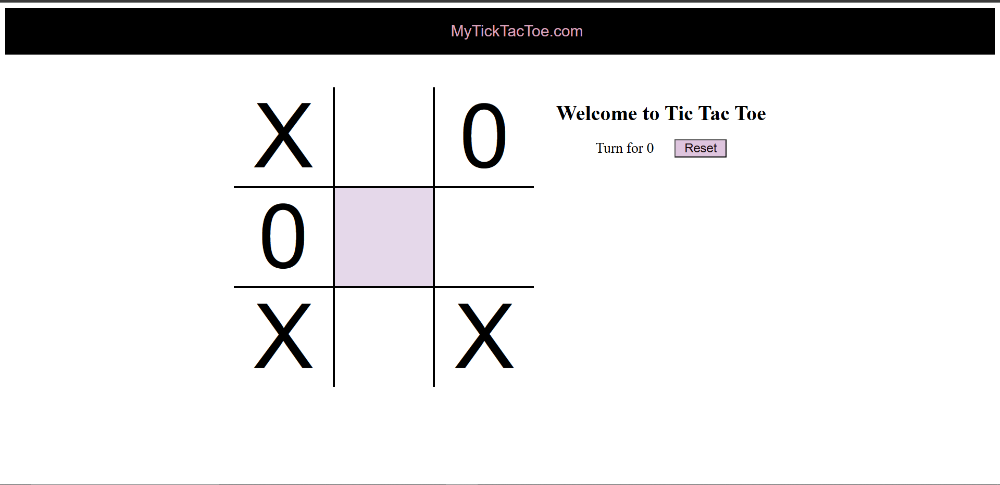
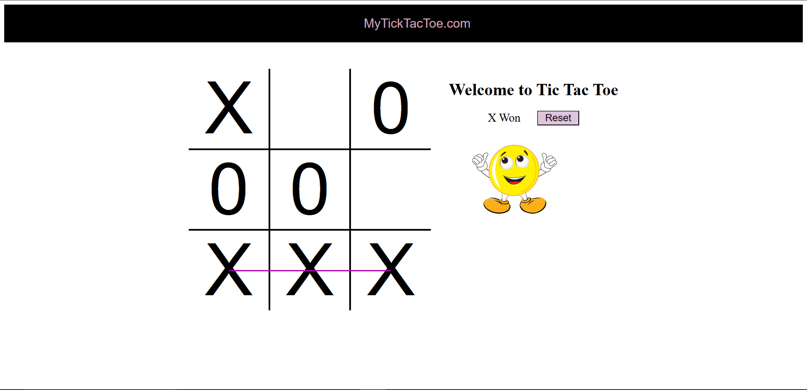

# ❌⭕ Tic-Tac-Toe Game

A simple and interactive **Tic-Tac-Toe** game built using **HTML**, **CSS**, and **JavaScript**. The game features sound effects, animations, winner detection, and an engaging user interface for a fun gaming experience.

---

## 🌐 Live Demo

👉 **Play the Game Here:** https://ayush-jaiswal-code99.github.io/Tic-Tac-Toe-Game/

## 🚀 Features

* 🎮 Two-player Tic-Tac-Toe gameplay
* 🏆 Automatic winner detection
* 🤝 Draw detection
* 🔊 Sound effects for moves and game over
* 🎉 Winning animation using GIF
* 🔄 Restart game option
* 📱 Clean and responsive user interface

---

## 🛠️ Tech Stack

* HTML5
* CSS3
* JavaScript (ES6)

---

## 📂 Project Structure

```text
Tic-Tac-Toe-Game/
│
├── Game-over.mp3
├── Music.mp3
├── README.md
├── Ting.mp3
├── excited.gif
├── index.html
├── screenshot1.png
├── screenshot2.png
├── script.js
└── style.css
```

---

## 🎮 How to Play

1. Download or clone the repository.
2. Open **index.html** in your web browser.
3. Player **X** starts the game.
4. Players take turns placing **X** and **O** on the board.
5. The game automatically detects a winner or a draw.
6. Click the **Reset** button to start a new game.

---

## 📸 GamePlay



## 📸 Result



---

## 🎵 Assets Used

* **Music.mp3** – Background music
* **Ting.mp3** – Sound effect played on each move
* **Game-over.mp3** – Played when the game ends
* **excited.gif** – Winner celebration animation

---

## 💡 What I Learned

While building this project, I practiced:

* DOM Manipulation
* Event Handling
* JavaScript Functions
* Arrays and Loops
* Game Logic Implementation
* Winner Detection Algorithm
* Audio Handling in JavaScript
* Dynamic UI Updates

---

## 🎯 Future Improvements

* 🤖 Add AI mode (Play against Computer)
* 🌙 Dark Mode
* 📊 Scoreboard for multiple rounds
* 💾 Save scores using Local Storage
* 📱 Better mobile responsiveness
* ✨ Improved animations and effects

---

## 👨‍💻 Author

**Ayush Jaiswal**

If you enjoyed this project, feel free to ⭐ the repository and share your feedback!
